# Instrumentum

## Idée

### Concept
Créer un monde abstrait combinant la musique et la technologie ayant pour but de permettre aux gens de s'amuser, de faire de la musique en groupe.
Il y aurait 5 piédestaux dont un cube par piédestals et chaque cubes produiraient des sons de manière indépendante, permettant à plusieurs personnes de jouer ensemble. 
Il y aurait une projection sur le mur faisant face aux 5 cubes et celle-ci sera aussi controllé par les cubes. 

## Références et inspirations

### Planche d'ambiance visuelles

### Pour les cubes

### Planche d'ambiance sonores 

L’ambiance sonore du projet est composée d’une boucle de basses et de nappes de synthé qui créent une atmosphère mystérieuse. Cette musique ajoute une tension constante et plonge le joueur dans l’univers du jeu.

[ambiance de fond](https://www.youtube.com/watch?v=L2eq-I0jY7Q)

## Références artistique

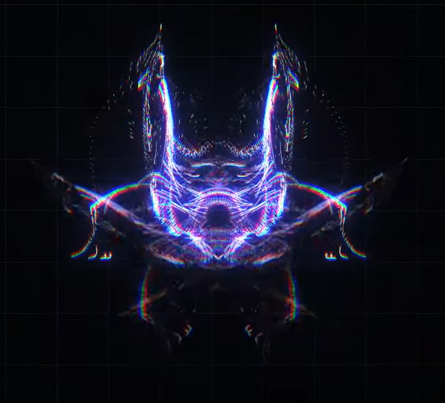

[Inspiration projection](https://youtu.be/ATLhkFcQZN0)

## Moodboard piédestal
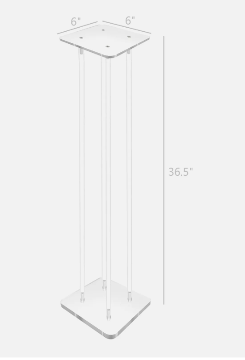

## Scénario Interactif (nouvelle version)

### Interactif

## Scénarimage / Simulation

### Simulation

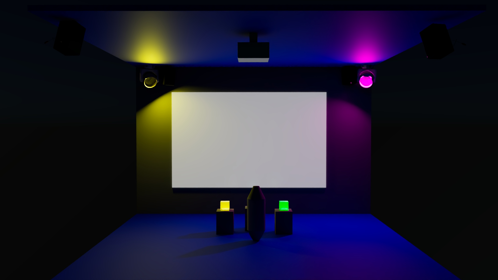
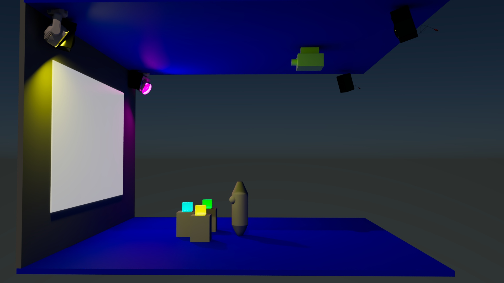

### Scénarimage
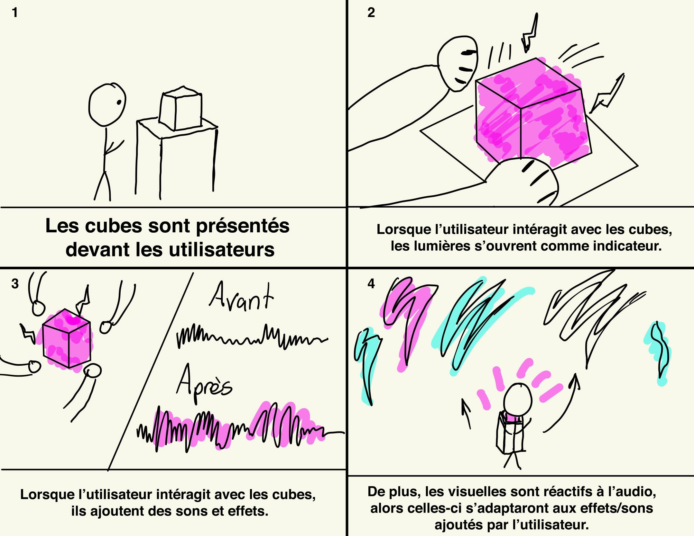

#### Organique

#### Organique Modifié (Synth)

#### Synth Complet

### Exemple Concret Dans Touch Designer (Merci à Victor)
https://youtu.be/ATLhkFcQZN0

## Synoptique

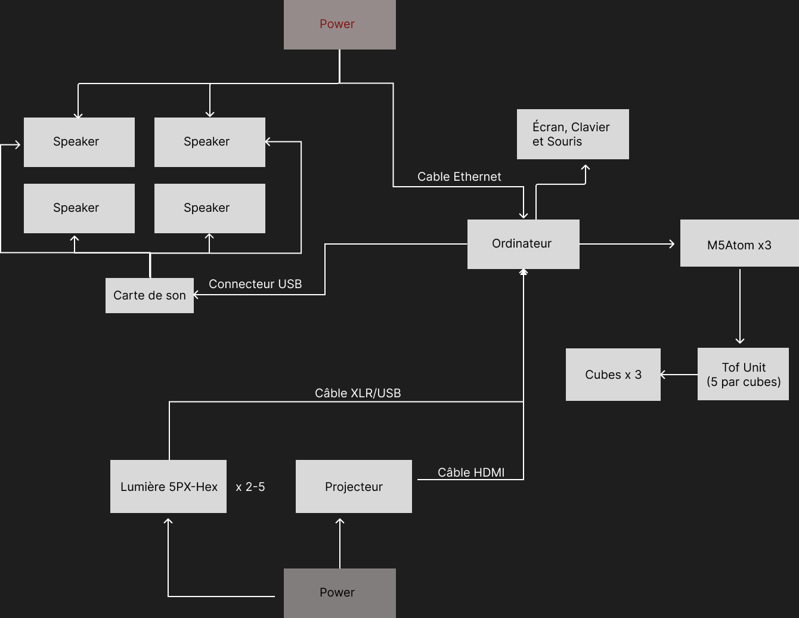

## Plantation
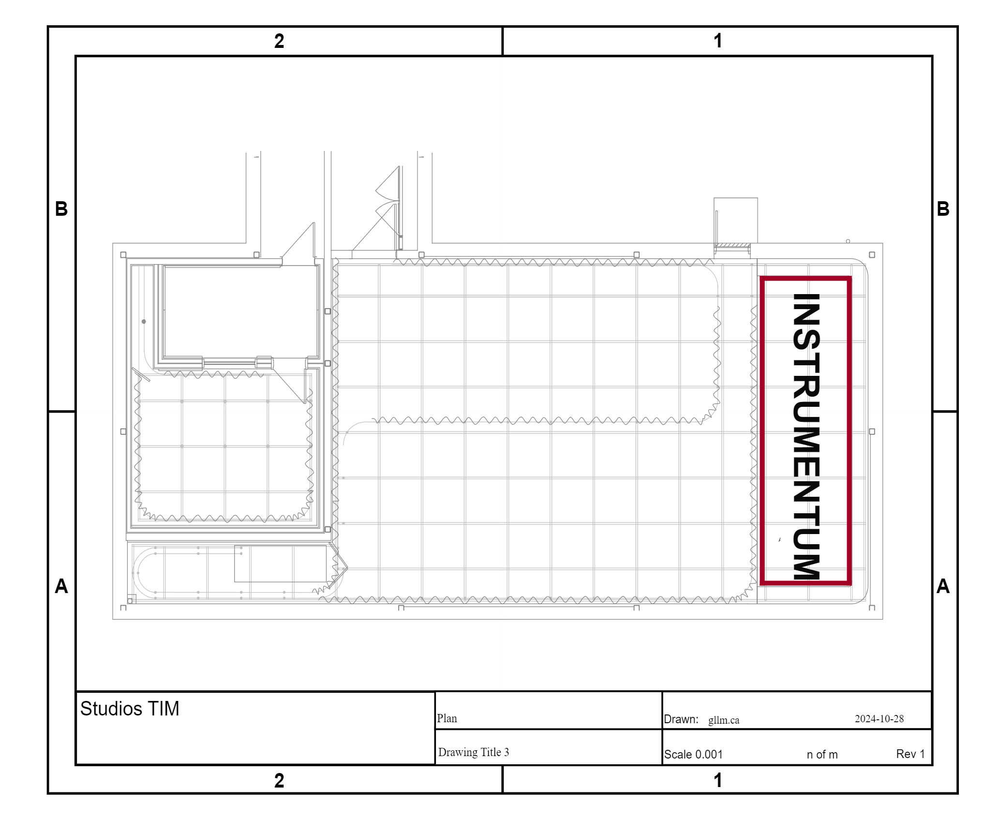

## Technologies

### Support médiatique
Donc, il aurait quelques fichiers **MP4** pour les bases des visuels, ensuite les instruments seront la source audio, et en midi il interagiront avec les autres logiciels (Touch Designer, reaper, Max, Qlc ou SoundSwitch) pour permettre une interaction visuelle et audiovisuelle.

### Matériel

#### Électronique

- 2-6 5PX-HEX (Lumières) [Documentation](https://www.adj.com/5px-hex)
  
  
- Ordinateurs (1 ou 2)

- Fils XLR

  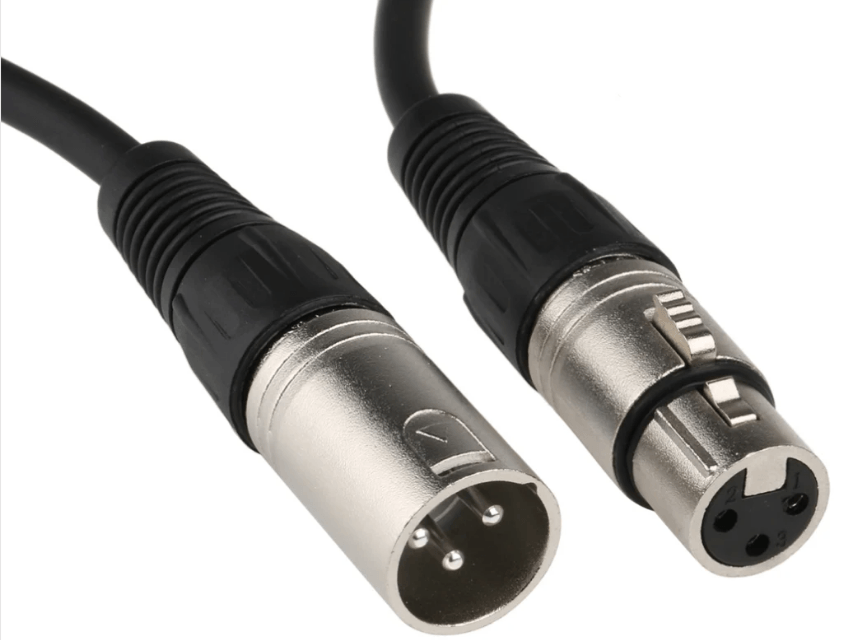
  
- Fils HDMI 

  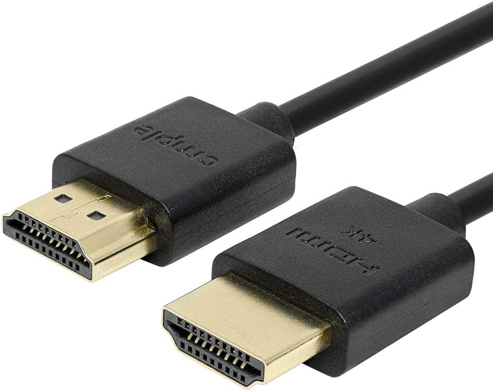

- [HDMI Extender](https://www.amazon.ca/Extender-Ethernet-Monitor-Automatic-Functions/dp/B0CLLVQ6BV?th=1)

  

- Fils USB-C

  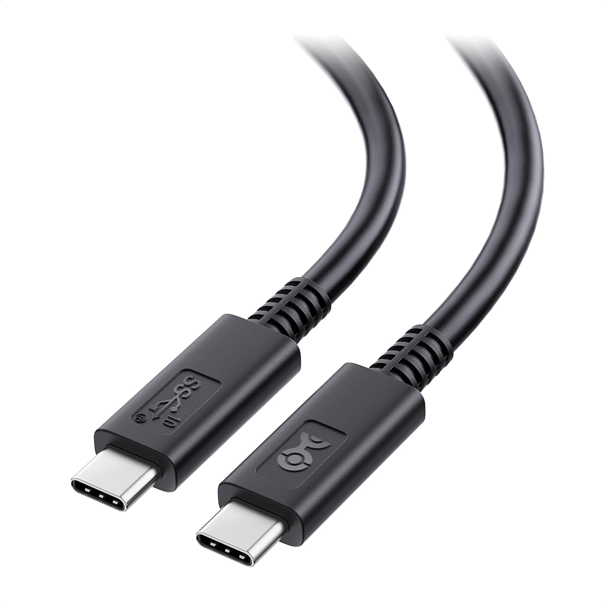
  
- Fils USB-A

  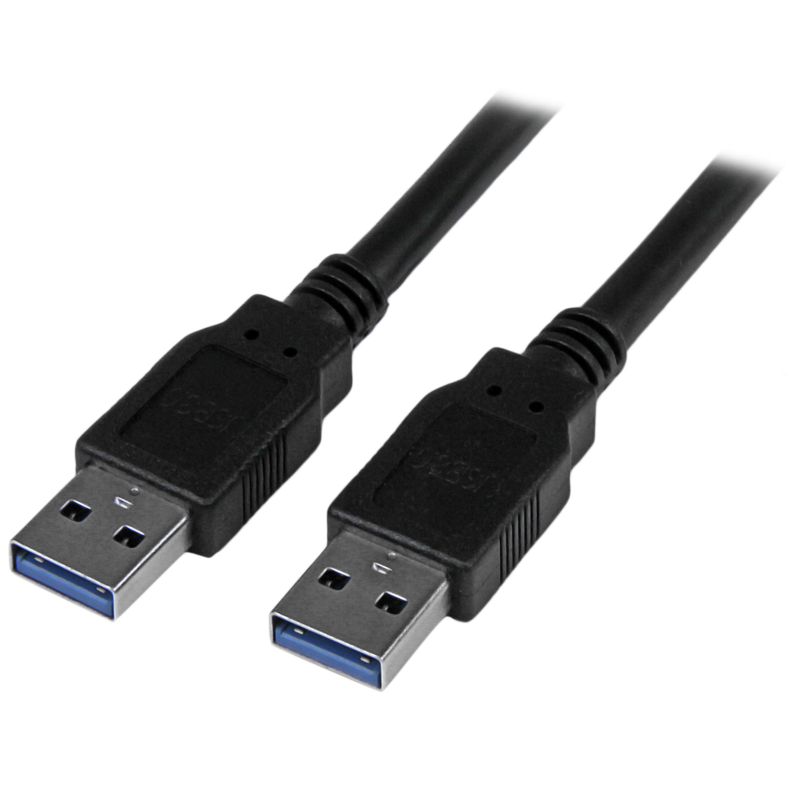

- 2-6 Speakers Genelec [Documentation](https://www.genelec.com/8040b)
  
  

#### Cubes (x3)

- extrusions Aluminium (Jointure en coin)

- Tof (5x par cube doon total de 15)

- 3x M5Atom

- 3x M5Atom adaptateur ethernet

- 3x M5Stack PbHub

- **Beaucoup de cables**
- 3x cables ethernet

#### Pour les stands et cubes
  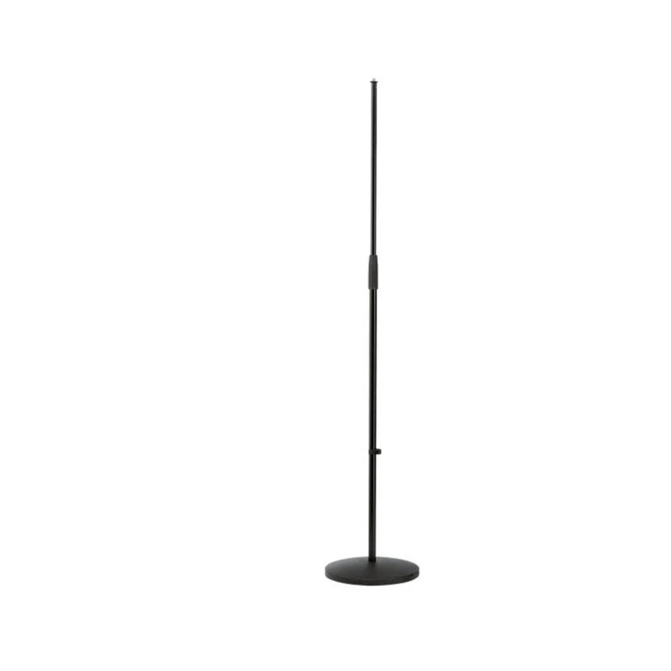

- [Extrusion d'aluminium 2020mm](https://www.amazon.ca/gp/product/B09WHCKS3P/?th=1)

  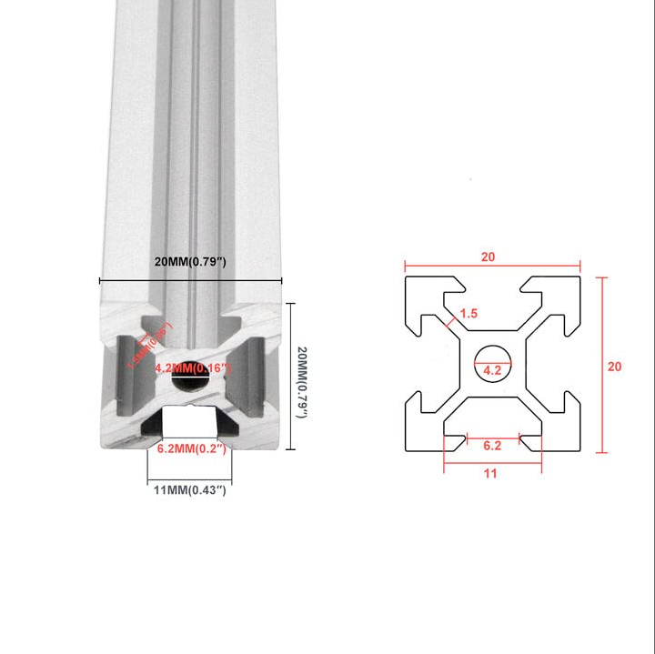
  
- Équerres d'angles à 3 voies

  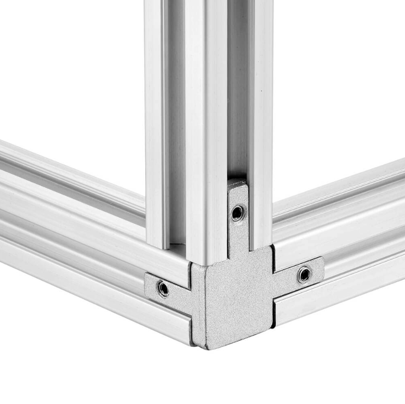

  ### Cout du matériel
| **Description**             | **Catégorie** | **Quantité** | **Coût unitaire** | **Montant** | **Liens** |
|-----------------------------|---------------|--------------|-------------------|-------------|----------|
| Pédestales                  | Équipement    | 5            |                   | 0 $         |          |
| Extrusions 1000mm           | Équipement    | 20           | 11 $              | 220 $       | [Lien](https://www.amazon.ca/-/fr/gp/product/B09Y1PL5GH/ref=ox_sc_act_title_1?smid=A2DGLVBBDAJTOF&th=1) |
| Équerres d'angles           | Équipement    | 3            | 24 $              | 72 $        | [Lien](https://www.amazon.ca/gp/product/B09WHCKS3P/?th=1) |
| ERYONE PLA Glow in the dark | Décoration    | 2            | 34 $              | 68 $        | [Lien](https://www.amazon.ca/dp/B0BBDYSQ14/ref=sspa_dk_detail_0?psc=1&pd_rd_i=B0BBDYSQ14&pd_rd_w=UDLm7&content-id=amzn1.sym.516c2169-755e-413a-a38a-68230f4ab66f&pf_rd_p=516c2169-755e-413a-a38a-68230f4ab66f&pf_rd_r=353WR54VF0VPZWZRZZ0N&pd_rd_wg=yV00x&pd_rd_r=a9b2b8bc-abaa-4031-8e5e-0d3206bfeb2d&s=office&sp_csd=d2lkZ2V0TmFtZT1zcF9kZXRhaWw) |
| TRONXY PLA Glow in the dark | Décoration    | 1            | 31 $              | 31 $        | [Lien](https://www.amazon.ca/-/fr/Filament-matériau-imprimante-changement-arc-en-ciel/dp/B0BPC7QRYW/ref=pd_sbs_d_sccl_4_3/141-0444918-1252260?pd_rd_w=5DyCj&content-id=amzn1.sym.548e628b-1a29-4955-b8b2-cd4ff764ebc9&pf_rd_p=548e628b-1a29-4955-b8b2-cd4ff764ebc9&pf_rd_r=Y3DAQ99H4779YZVVCDCA&pd_rd_wg=zv7Fz&pd_rd_r=9db453d8-71a3-4b77-81d3-b1b273256104&pd_rd_i=B0BPC7QRYW&th=1) |

  

### Logiciels
Différents Logiciels seront utilisé pour que les projections, les instruments et les lumières intéragissents entre elles.

- TouchDesigner (Pour la projection et l'intéraction sur les visuels)
- QLC+ (Pour les lumières et l'intéractivité avec celle-ci)
- Blender / Maya (Pour modéliser les cubes)
- Ableton live 12 (son)

Le réseau de communication serait majoritairement midi car celle-ci est faite pour la détection d’audio d’instruments musicales.

## Réferences: 

https://village-numerique.mutek.org/fr/installations/isochrone-par-manuel-chantre

## Équipe 

#### Role 

#### Motivation

### Victor

#### Role 

#### Motivation

### Maik

#### Role 

#### Motivation

### Michael

#### Role 

#### Motivation

### Pierre-Luc

#### Role 

#### Motivation

### Joshua

#### Role 
Monteur Vidéo (Touch Designer, After Effects)

#### Motivation
J'adore le montage vidéo, et de pouvoir essayer d'intégrer cela dans une installation propre et unique à nous serait un défi que j'aimerais grandement relever. De plus, ce role m'aidera à raffiner mes compétences à créer de l'art abstrait et de pratiquer mon utilisation de TouchDesigner.
