# Instrumentum

## Idée

### Concept
Créer un monde abstrait combinant la musique et la technologie ayant pour but de permettre aux gens de s'amuser et de faire de la musique en groupe. Il y aurait 5 piédestaux dont un cube par piédestals et chaque cubes produiraient des sons de manière indépendante, permettant à 5 personnes de jouer ensemble. Il y aurait une projection sur le mur faisant face aux 5 cubes et celle-ci sera aussi controllé par les cubes. Pour chaque forme,  il y aurait 2 TOF qui seront placé un à l'oposé de l'autre, à l'intérieur du cube ( les faces auront un trou pour que le TOF puisse détecter les mouvements), pour pouvoir détecter la distance de chaques main. La main droite controlerait le volume et la main gauche controlerait un effet audio ( ex: phaser, distortion, etc) affectant la boucle audio du cube respectif. 

## Références et inspirations

### Planche d'ambiance visuelles

### Pour les cubes

### Planche d'ambiance sonores 

Le projet a une ambiance qui joue en boucle composé de basse synthé et de nappes de synthé.

[ambiance de fond](https://www.youtube.com/watch?v=L2eq-I0jY7Q)

## Références artistique

## Scénario Interactif

### Interactif
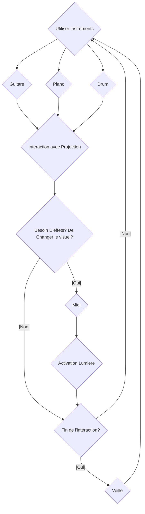
### Narratif
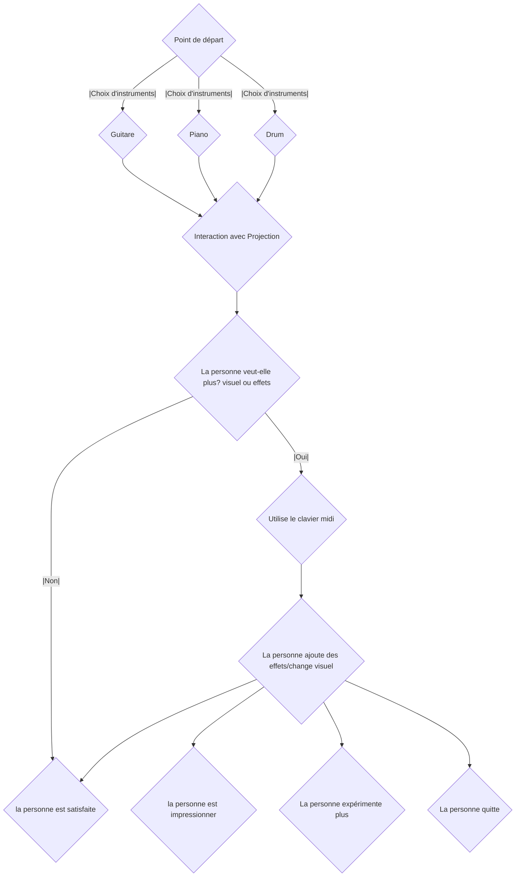

<!--

## Scénarimage / Simulation

### Simulation
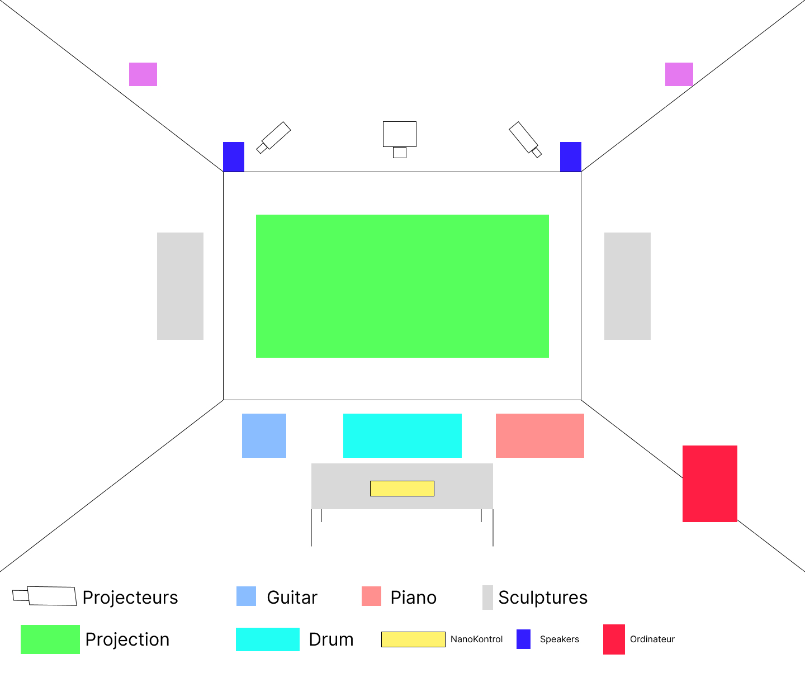

### Scénarimage
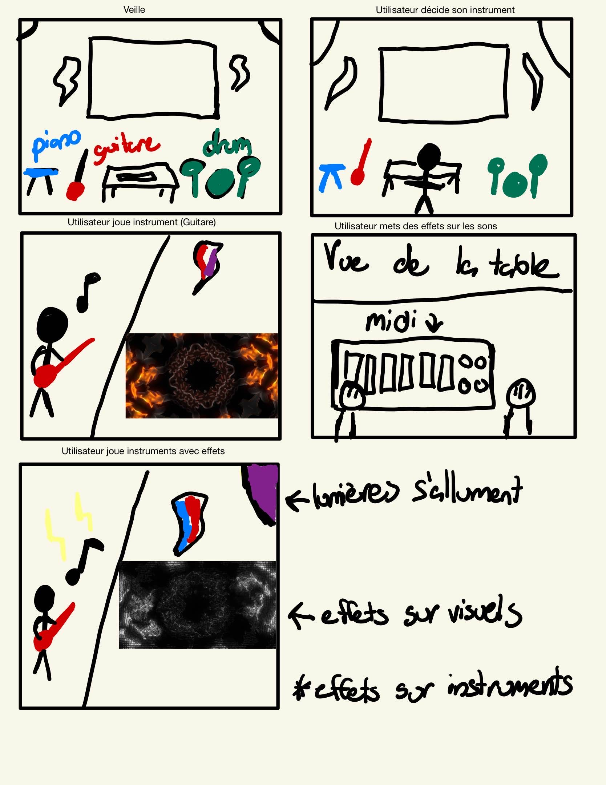

#### Organique
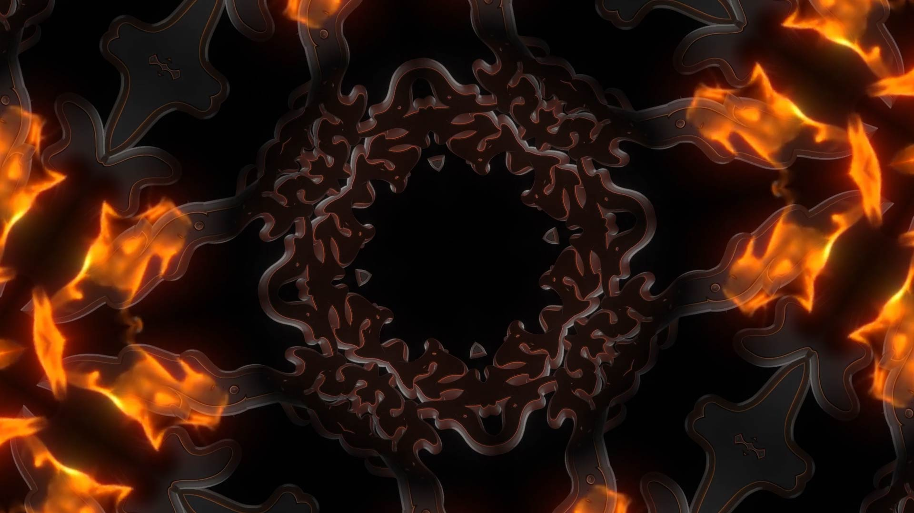

#### Organique Modifié (Synth)
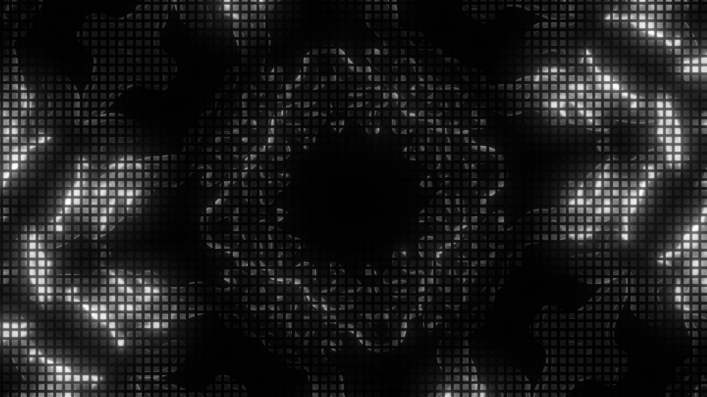

#### Synth Complet
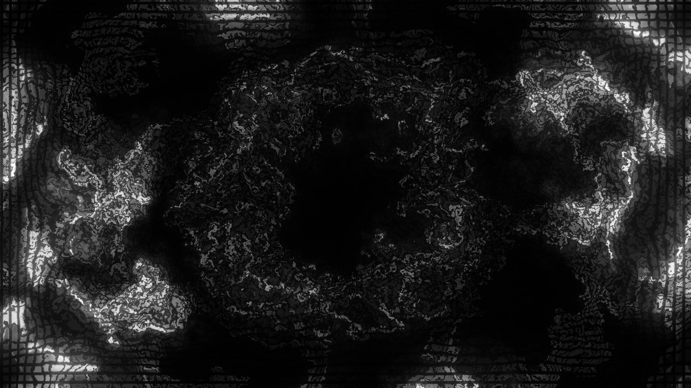

### Exemple Concret Dans Touch Designer (Merci à Victor)
https://youtu.be/ATLhkFcQZN0

## Synoptique

## Plantation

## Technologies

### Support médiatique
Donc, il aurait quelques mp4 pour les bases des visuels, ensuite les instruments seront la source audio, et en midi il interagiront avec les autres logiciels (Touch Designer, reaper, Max, Qlc ou SoundSwitch) pour permettre une interaction visuelle et audiovisuelle.

### Matériel

#### Électronique
- 3 [Epsum Home Cinema 2150 Wireless 3CLD Projector](https://epson.ca/Remise-%C3%A0-neuf-certifi%C3%A9e/Divertissement-%C3%A0-domicile/Home-Cinema-2150-Wireless-1080p-3LCD-Projector---Remise-%C3%A0-neuf-certifi%C3%A9e/p/V11H852020-N)
  
  
- 2-6 5PX-HEX (Lumières)
  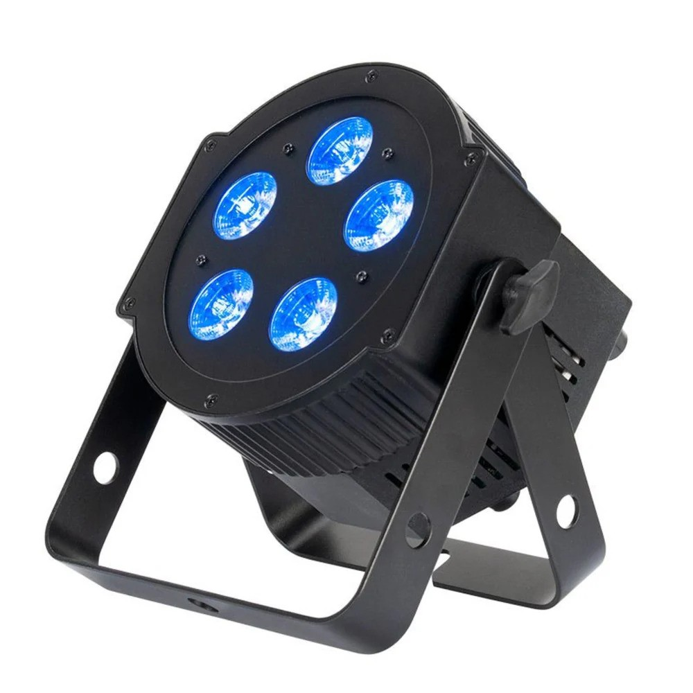
  
- 2 Sculpture Mains
  
  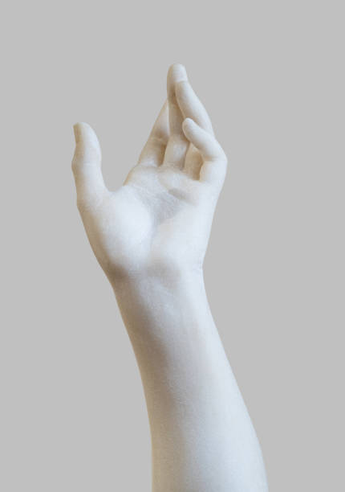

- [Support pour les sculptures](https://youtu.be/exuQNdkZcog)
  
- Ordinateurs (1 ou 2)
  
- NanoKontrol 2
  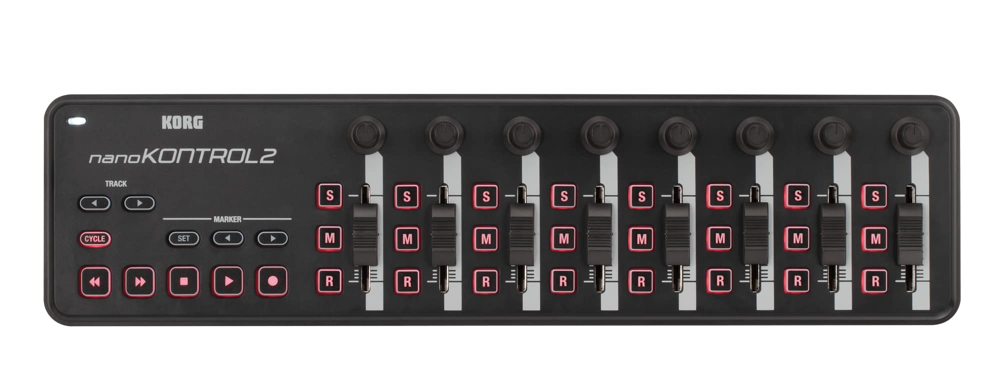
  
- Fils XLR, HDMI, USB-C, USB-A
- 2-6 Speakers Genelec
  
  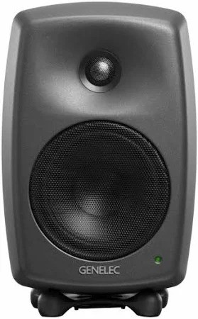

#### Instruments
- Akai MPK Mini Plus 37-key Keyboard
  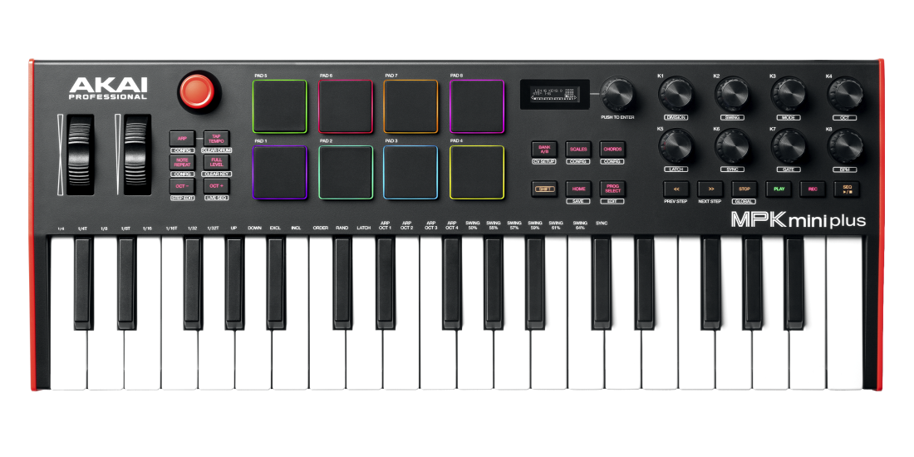
  
- EART Electric Guitar SSS Single Coil
  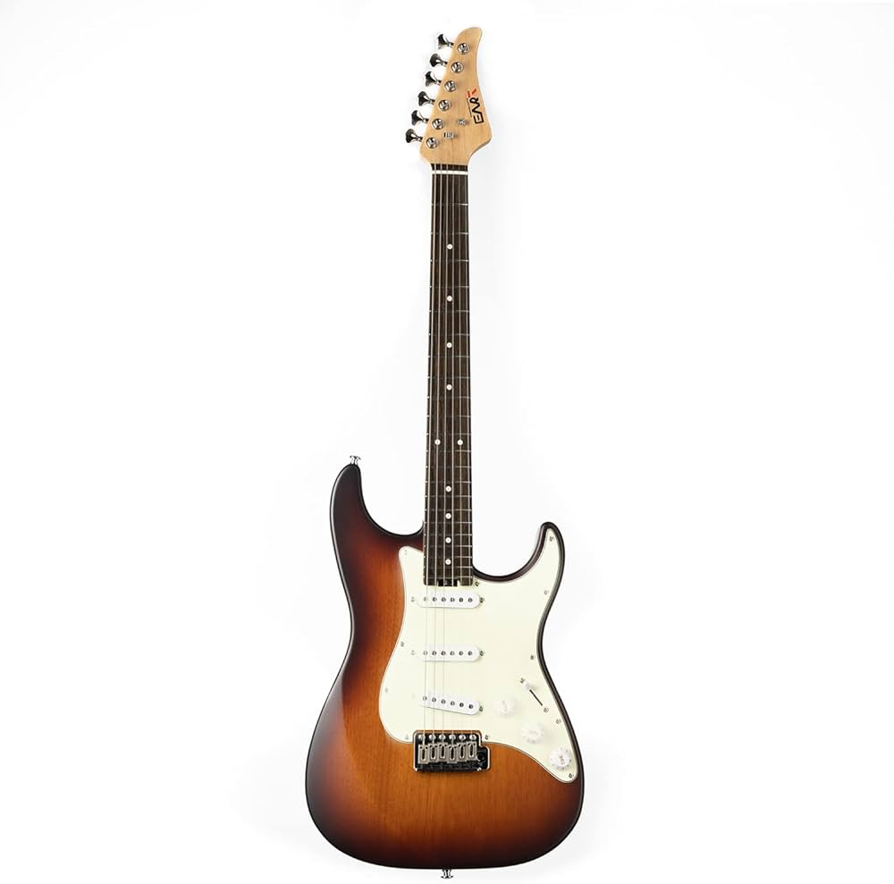
  
- Donner Electric Drum Set
  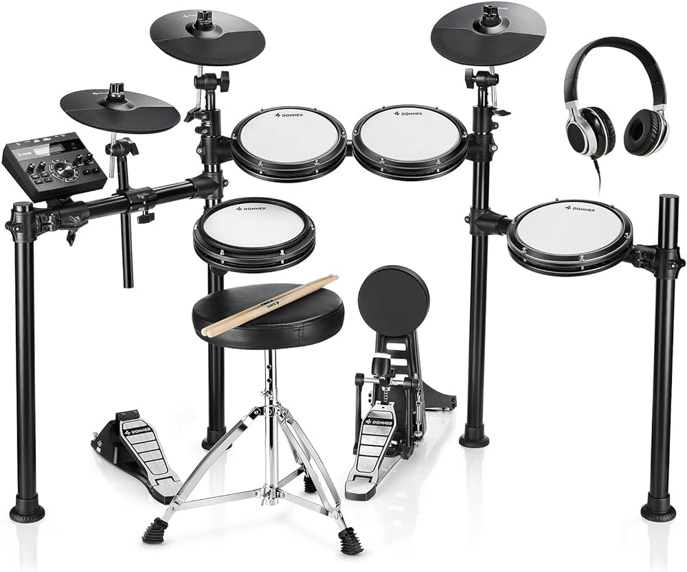
  

### Logiciels
Différents Logiciels seront utilisé pour que les projections, les instruments et les lumières intéragissents entre elles.

- Touch Designer (Pour la projection et l'intéraction sur les visuels)
- MadMapper (Pour mapper les visuels sur les sculptures)
- After Effects (Pour les visuels de bases de l'écran)
- QLC+ ou SoundSwitch (Pour les lumières et l'intéractivité avec celle-ci)
- Reaper ou Max (Pour la détection d’audio des instruments, et les effets sur celle-ci)
- Blender / Maya (Pour les bases de visuels 3D, objets, etc.)

Le réseau de communication serait majoritairement midi car celle-ci est faite pour la détection d’audio d’instruments musicales.

## Réferences: 

https://village-numerique.mutek.org/fr/installations/isochrone-par-manuel-chantre

-->

