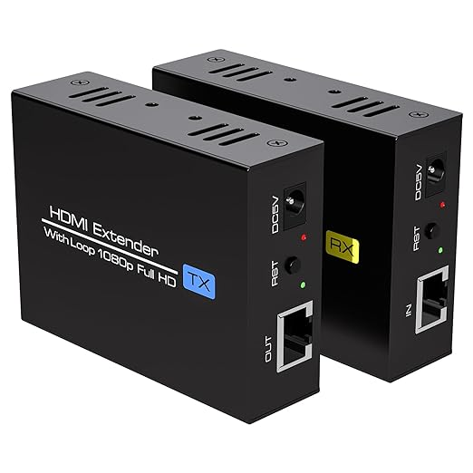
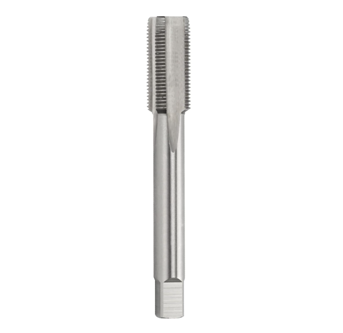
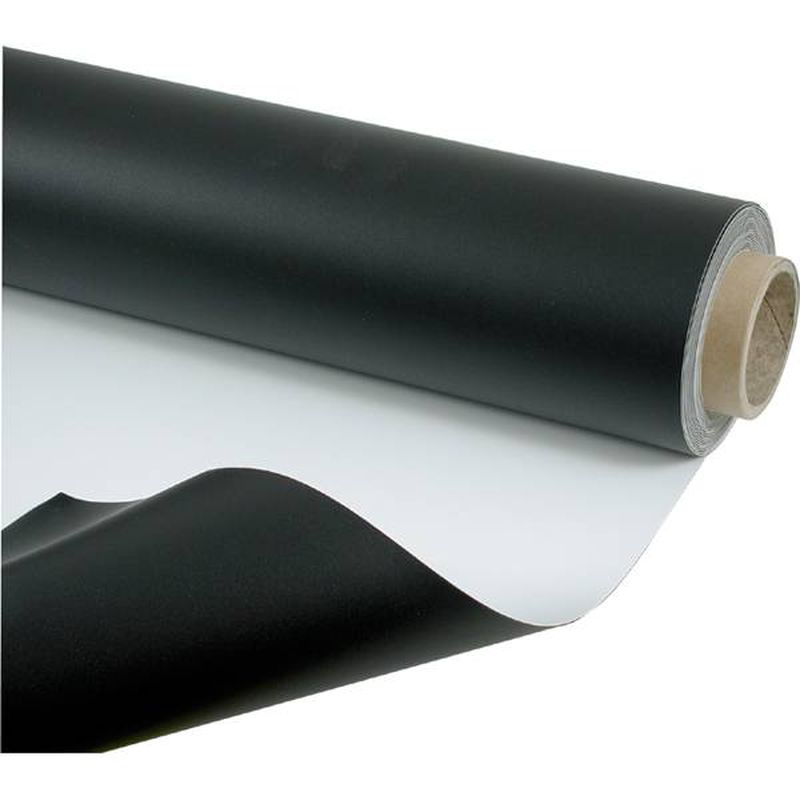

# Instrumentum
[SlideShow](https://docs.google.com/presentation/d/1q3NwvzlKlE0zQZpyrD8DxW99CKK96IRwOWyMbUH8yd4/edit#slide=id.g31b8165a46e_0_252)
## Idée

### Concept
Créer un monde abstrait combinant la musique et la technologie ayant pour but de permettre aux gens de s'amuser, de faire de la musique en groupe.
Il y aurait 3-5 piédestaux dont un cube par piédestals et chaque cubes produiraient des sons de manière indépendante, permettant à plusieurs personnes de jouer ensemble. 
Il y aurait une projection sur le mur faisant face aux 5 cubes et celle-ci sera aussi controllé par les cubes. 

## Références et inspirations

### Planche d'ambiance visuelles

### Pour les cubes

### Planche d'ambiance sonores 

L’ambiance sonore du projet est composée d’une boucle de basses et de nappes de synthé qui créent une atmosphère mystérieuse. Cette musique ajoute une tension constante et plonge le joueur dans l’univers du jeu.

[ambiance de fond](https://www.youtube.com/watch?v=L2eq-I0jY7Q)

## Références artistique

[Inspiration projection](https://youtu.be/ATLhkFcQZN0)

## Moodboard piédestal

## Scénario Interactif

### Interactif

## Scénarimage / Simulation

### Simulation

### Scénarimage

#### Organique

#### Organique Modifié (Synth)

#### Synth Complet

### Exemple Concret Dans Touch Designer (Merci à Victor)
https://youtu.be/ATLhkFcQZN0

## Synoptique

## Plantation

## Technologies

### Support médiatique
Donc, il aurait quelques fichiers **MP4** pour les bases des visuels, ensuite les instruments seront la source audio, et en midi il interagiront avec les autres logiciels (Touch Designer, reaper, Max, Qlc ou SoundSwitch) pour permettre une interaction visuelle et audiovisuelle.

### Matériel

#### Électronique

- 2-6 5PX-HEX (Lumières) [Documentation](https://www.adj.com/5px-hex)
  
  
- Ordinateurs (1 ou 2)

- Fils XLR

  
  
- Fils HDMI 

  

- [HDMI Extender](https://www.amazon.ca/Extender-Ethernet-Monitor-Automatic-Functions/dp/B0CLLVQ6BV?th=1)

  

- Fils USB-C

  
  
- Fils USB-A

  

- 2-6 Speakers Genelec [Documentation](https://www.genelec.com/8040b)
  
  

#### Cubes (x3)

- extrusions Aluminium (Jointure en coin)

- Tof (5x par cube doon total de 15)

- 3x M5Atom

- 3x M5Atom adaptateur ethernet

- 3x M5Stack PbHub

- **Beaucoup de cables**
- 3x cables ethernet

#### Pour les stands et cubes
  

- [Extrusion d'aluminium 2020mm](https://www.amazon.ca/gp/product/B09WHCKS3P/?th=1)

  
  
- Équerres d'angles à 3 voies

  

- Taraud 3/8

  

- Tapis de dance

  

  ### Cout du matériel
| **Description**             | **Catégorie** | **Quantité** | **Coût unitaire** | **Montant** | **Liens** |
|-----------------------------|---------------|--------------|-------------------|-------------|----------|
| Pédestales                  | Équipement    | 5            |                   | 0 $         |          |
| Extrusions 1000mm           | Équipement    | 20           | 11 $              | 220 $       | [Lien](https://www.amazon.ca/-/fr/gp/product/B09Y1PL5GH/ref=ox_sc_act_title_1?smid=A2DGLVBBDAJTOF&th=1) |
| Équerres d'angles           | Équipement    | 3            | 24 $              | 72 $        | [Lien](https://www.amazon.ca/gp/product/B09WHCKS3P/?th=1) |
| ERYONE PLA Glow in the dark | Décoration    | 2            | 34 $              | 68 $        | [Lien](https://www.amazon.ca/dp/B0BBDYSQ14/ref=sspa_dk_detail_0?psc=1&pd_rd_i=B0BBDYSQ14&pd_rd_w=UDLm7&content-id=amzn1.sym.516c2169-755e-413a-a38a-68230f4ab66f&pf_rd_p=516c2169-755e-413a-a38a-68230f4ab66f&pf_rd_r=353WR54VF0VPZWZRZZ0N&pd_rd_wg=yV00x&pd_rd_r=a9b2b8bc-abaa-4031-8e5e-0d3206bfeb2d&s=office&sp_csd=d2lkZ2V0TmFtZT1zcF9kZXRhaWw) |
| TRONXY PLA Glow in the dark | Décoration    | 1            | 31 $              | 31 $        | [Lien](https://www.amazon.ca/-/fr/Filament-matériau-imprimante-changement-arc-en-ciel/dp/B0BPC7QRYW/ref=pd_sbs_d_sccl_4_3/141-0444918-1252260?pd_rd_w=5DyCj&content-id=amzn1.sym.548e628b-1a29-4955-b8b2-cd4ff764ebc9&pf_rd_p=548e628b-1a29-4955-b8b2-cd4ff764ebc9&pf_rd_r=Y3DAQ99H4779YZVVCDCA&pd_rd_wg=zv7Fz&pd_rd_r=9db453d8-71a3-4b77-81d3-b1b273256104&pd_rd_i=B0BPC7QRYW&th=1) |
| Taraud 3/8                  | Équipement    | 1           | 20$               | 20$       | [Lien](https://www.amazon.ca/Accusize-Industrial-longueur-cannelures-am%C3%A9ricaine/dp/B01AVDYKE2/ref=sr_1_2_sspa?crid=3FL2ZXXB5LOP5&dib=eyJ2IjoiMSJ9.Ydbn7fpkNjKnO_-tvq_uHWZOhn2aeVNsxcB_5ReiRP9ghS6Ro-ku7zq6hGSwHIDOv61bSTq33HckeRQD541nQHD8ngR9mzHNaKMDccHE6V2nxkt-9qKrf1o9gI2iFcjAbVtmhmD9RE4kKyOuAIp-LAnl-NUC_QvAPRxWJ9a_Jlp0E2ndOZvQjHgyFEJAnOKqiX1czd1t10xOuCKbEwxQzAvTVwEfltNS7ECpioN_2KLOB_iXbS8BfAutbD2DzhaerbRm_JssAGbWhNNaq3CaK0WtVCMcbyUaMUAfirwkO18.I6_IoDguPlNgfqw50lesOdLS7xxOcTPQ8Hitm08iWMI&dib_tag=se&keywords=taraud%2B3%2F8&qid=1733338144&sprefix=taraud%2B3%2F%2Caps%2C72&sr=8-2-spons&sp_csd=d2lkZ2V0TmFtZT1zcF9hdGY&th=1) |

  

### Logiciels
Différents Logiciels seront utilisé pour que les projections, les instruments et les lumières intéragissents entre elles.

- TouchDesigner (Pour la projection et l'intéraction sur les visuels)
- QLC+ (Pour les lumières et l'intéractivité avec celle-ci)
- Blender / Maya (Pour modéliser les cubes)
- Ableton live 12 (son)
- Reaper (son)
- Arduino (code)

Le réseau de communication serait majoritairement midi car celle-ci est faite pour la détection d’audio d’instruments musicales.

## Réferences: 

https://village-numerique.mutek.org/fr/installations/isochrone-par-manuel-chantre

## Équipe 

#### Role 

#### Motivation

### Victor

#### Role

Programmation : arduino + TouchDesigner

#### Motivation

J'aime programmer des programmes pour effectuer des fonctions et faire des recherches pour y arriver. C'est très satisfaisant quand c'est complété. Réussir à faire une installation et programme fonctionnel.

#### Étude de faisabilité
Communication entre les M5Atom avec un code Arduino à TouchDesigner. Nécessite un programme Arduino, TouchDesigner et plugData pour recevoir plusieurs informations en même temps. Nécessite l'achat de 5 tofs par cube plus 3 PbHub pour les connecter au M5Atom (fournis en partie par l'école, peut-être acheté si la quantité optimale n'est pas atteinte.).
Nécessite une connaissance de C++ dans Arduino, des connaissances sur TouchDesigner plus PlugData pour la communication.

Commencer des tests le plus tôt possible. Dans la 1re et 2e semaine, avoir au moins une installation pour un cube fonctionnel et qui envoie de l'information. Dans la 3e semaine ou plus tôt si possible, faire marcher la communication entre tous les M5Atom.

Risque : 
-  Communication non fonctionnelle
-  Programme C++ n'envoie pas l'information correcte
-  Overload du M5Atom

Solution : 
-  Multiple test avec un protory d'un seul cube.
-  Test avec seulement le M5Atom et Oscin dans TouchDesigner
-  Faire attention que le M5Atom ne devienne jamais trop chaud ou ne veut pas "reset"

### Maik

#### Role 
Concepteur sonore
#### Motivation
J'ai toujours aimé faire de la musique ainsi que la conception sonore puisque en plus d'être un passe-temps, cela aide a gérer mon anxiété. Si je n'étudie pas, habituellement je fait de la musique.

#### Étude de faisabilité
La composition sonore a une importance pour Instrumentum puisque le but principal de notre projet est de pouvoir faire de la musique avec les cubes. Les défis pour cette partie est de trouver des ambiances et effet sonores qui compléementent bien le projet et de bien connaitre les DAW ( Reaper et Ableton ).  

Risque :
- Le son coupe ou glitch en sortant des speakers.
  

Solutions :
- S'assurer que les sons ont des limiter et que le mixing est bien fait. Controller le sons dans un autre ordinateur
  

### Michael

#### Role 

Modelage des faces des cubes, creation de média, installation (projecteur, speaker, cube)

#### Motivation

Je veux donner un Esthetic au projet qui est propre et beaux à regarder. je trouve important que la scène soit agréable pour les utilisateurs.

#### Étude de faisabilité
L'installation est au cœur du projet Instrumentum. Elle se compose de 4 enceintes Genelec placées dans les quatre coins du plafond, de 2 lumières au plafond orientées vers les piliers pour les éclairer, d'un projecteur (PowerLite 109W) situé à 7,1 m du mur de projection et à 0,5 m du plafond. Les piliers seront des supports pour micros, sur lesquels nous pourrons fixer les cubes à l'aide de tarauds. Le tout sera installé sur un tapis de danse pour protéger le sol.

### Pierre-Luc

#### Role 

Modelage des cubes + Touch Designer

#### Motivation
J'adore faire de la modélisation 3D, surtout si mes créations peuvent devenir réelles, c'est comme un passe-temps. De plus, il est important pour moi que TouchDesigner soit fluide et esthétique.

#### Étude de faisabilité
La modélisation est essentielle pour Instrumentum puisque ces cubes seront imprimés pour qu'on puisse ensuite les installer et s'en servir pour lorsqu'on les touches, ils émettent du son. Les défis c'est de trouver de l'inspiration pour que les cubes soivent esthétiquement jolis. 

Ensuite pour le Touch Designer, c'est important de faire un code pour que effets visuelles et sonores fonctionnent bien. Les défis pour cette partie sera de trouver un façon pour les nodes de touch designer s'intègre bien au projet.

### Joshua

#### Role 
Monteur Vidéo (Touch Designer, After Effects)

#### Motivation
J'adore le montage vidéo, et de pouvoir essayer d'intégrer cela dans une installation propre et unique à nous serait un défi que j'aimerais grandement relever. De plus, ce role m'aidera à raffiner mes compétences à créer de l'art abstrait et de pratiquer mon utilisation de TouchDesigner.

#### Étude de faisabilité 
Le visuel est très important au projet. En effet, c’est un des élément avec lequel l’utilisateur pourra interagir. De plus, il est important de créer un visuel intéressant et unique tout en considérant les différentes réactions que celle-ci peut avoir. De plus, le visuel peut être basé sur des objets 3D, ou vidéo créé sur After Effects.

