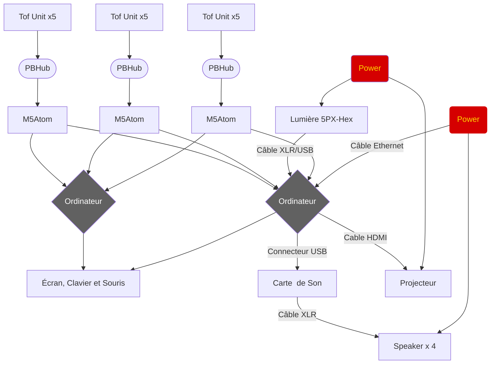

```mermaid
flowchart TD
    n1["Power"] --> n2["Speaker x 4"]
    n1 -- Câble Ethernet --> n3["Ordinateur"]
    n3 --> n10["Écran, Clavier et Souris"]
    n3 -- Connecteur USB --> n11["Carte&nbsp; de Son"]
    n4["M5Atom"] --> n13["Ordinateur"] & n3
    n7["Power"] --> n8["Projecteur"] & n9["Lumière 5PX-Hex"]
    n9 -- Câble XLR/USB --> n3
    n11 -- Câble XLR --> n2
    n16["M5Atom"] --> n13 & n3
    n14["M5Atom"] --> n13 & n3
    n13 --> n10
    n15["Tof Unit x5"] --> n18(["PBHub"])
    n18 --> n14
    n5["Tof Unit x5"] --> n19(["PBHub"])
    n17["Tof Unit x5"] --> n20(["PBHub"])
    n19 --> n16
    n20 --> n4
    n3 -- Cable HDMI --> n8

    n1@{ shape: rounded}
    n2@{ shape: rect}
    n3@{ shape: diam}
    n13@{ shape: diam}
    n7@{ shape: rounded}
    n16@{ shape: rect}
    n14@{ shape: rect}
    n15@{ shape: rect}
    n17@{ shape: rect}
    style n1 stroke:#D50000,fill:#D50000,color:#FFD600
    style n3 fill:#616161,color:#FFFFFF
    style n13 fill:#616161,color:#FFFFFF
    style n7 fill:#D50000,color:#FFD600
```
